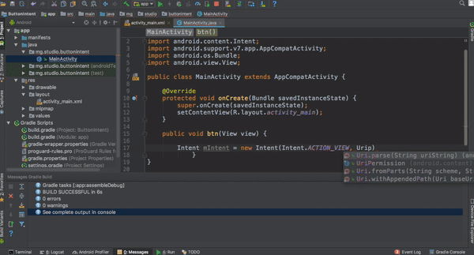
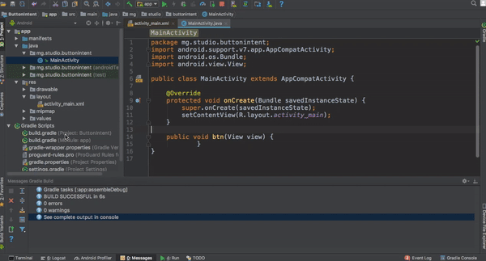

# An intent

An intent is an abstract description of an operation to be performed. It can be used with startActivity to launch an Activity. An Intent is mainly used for launching of activities, where it can be thought of as the connector between activities. [source](https://developer.android.com/reference/android/content/Intent.html)

The primary pieces of information in an intent are:

action -- The general action to be performed, such as ACTION_VIEW, ACTION_EDIT, ACTION_MAIN, etc.

data -- The data to operate on, such as a person record in the contacts database, expressed as a Uri.






```java
package mg.studio.buttonintent;

import android.content.Intent;
import android.net.Uri;
import android.support.v7.app.AppCompatActivity;
import android.os.Bundle;
import android.view.View;

public class MainActivity extends AppCompatActivity {

    @Override
    protected void onCreate(Bundle savedInstanceState) {
        super.onCreate(savedInstanceState);
        setContentView(R.layout.activity_main);
    }

    public void btn(View view) {

        Intent mIntent = new Intent(Intent.ACTION_VIEW, Uri.parse("http://cqu.edu.cn"));
        startActivity(mIntent);
    }
}

```

and here is the layout

```xml
<?xml version="1.0" encoding="utf-8"?>
<android.support.constraint.ConstraintLayout xmlns:android="http://schemas.android.com/apk/res/android"
    xmlns:app="http://schemas.android.com/apk/res-auto"
    xmlns:tools="http://schemas.android.com/tools"
    android:layout_width="match_parent"
    android:layout_height="match_parent"
    tools:context="mg.studio.buttonintent.MainActivity">

    <Button
        android:id="@+id/button"
        android:layout_width="wrap_content"
        android:layout_height="wrap_content"
        android:layout_marginBottom="8dp"
        android:layout_marginEnd="8dp"
        android:layout_marginStart="8dp"
        android:layout_marginTop="8dp"
        android:onClick="btn"
        android:text="Button"
        app:layout_constraintBottom_toBottomOf="parent"
        app:layout_constraintEnd_toEndOf="parent"
        app:layout_constraintStart_toStartOf="parent"
        app:layout_constraintTop_toTopOf="parent" />
</android.support.constraint.ConstraintLayout>


```
