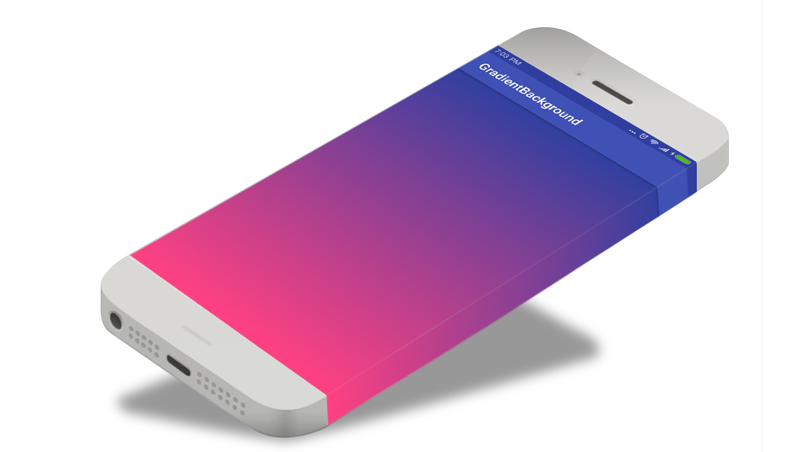
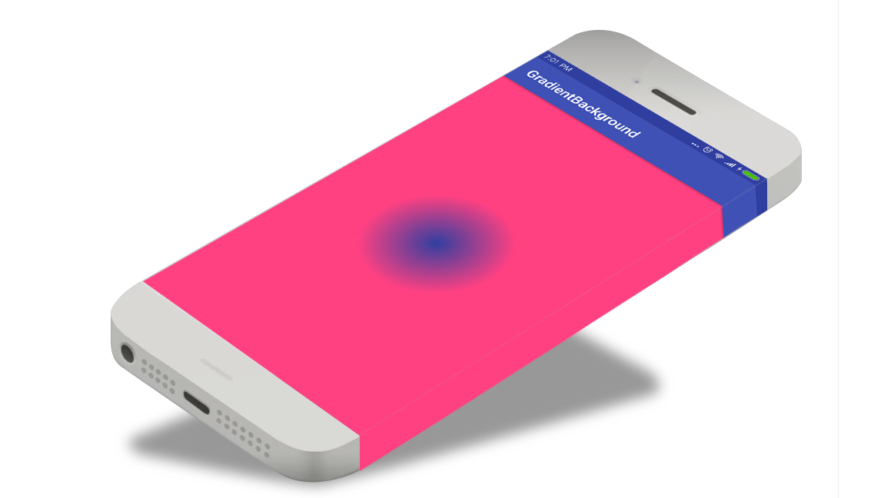
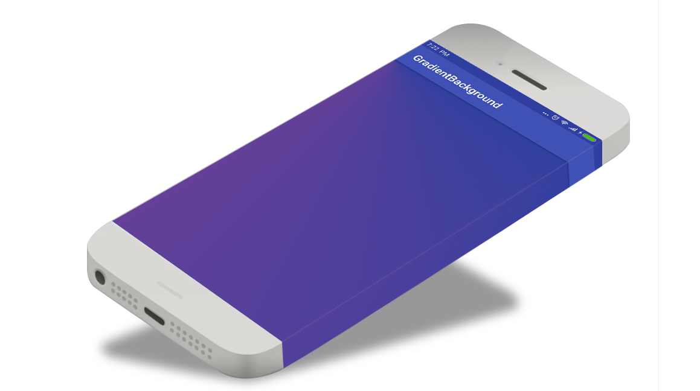

# Background gradient

Before, when I needed a gradient effect (smooth transition between multiple colors) as a background of my acitivy, I always used and image and stretched it to fill parent on both height and width. It is good to know that you can create a drawable xml file to specify a shape with a linear, radial or sweep gradient effect.

For all the below implementation, just create a new android project and create a new file "background_gradient.xml" in your drawable folder. Use this as the backgound of your activity layout file

```xml
android:background="@drawable/background_gradient_linear"
```

### Linear

There are 4 parameters: angle, startColor, endColor and type.

```xml
<?xml version="1.0" encoding="utf-8"?>
<shape
	xmlns:android="http://schemas.android.com/apk/res/android"
	android:shape="rectangle">
	<gradient
		android:angle="270"
        android:startColor="@color/colorPrimaryDark"
        android:endColor="@color/colorAccent"
		android:type="linear" />
</shape>
```



### Radial

There are 4 parameters: gradientRadius, startColor, endColor and type.

```xml
<?xml version="1.0" encoding="utf-8"?>
<shape xmlns:android="http://schemas.android.com/apk/res/android"
    android:shape="rectangle">
    <gradient
        android:gradientRadius="270"
        android:startColor="@color/colorPrimaryDark"
        android:endColor="@color/colorAccent"
        android:type="radial" />
</shape>
```


### Sweep

Specifying the type, endColor and startColor is yet enough.

```
<?xml version="1.0" encoding="utf-8"?>
<shape xmlns:android="http://schemas.android.com/apk/res/android"
    android:shape="rectangle">
    <gradient
        android:endColor="@color/colorAccent"
        android:startColor="@color/colorPrimaryDark"
        android:type="sweep" />
</shape>
```
The above code outputs exactly the same as the following.


```xml
<?xml version="1.0" encoding="utf-8"?>
<shape xmlns:android="http://schemas.android.com/apk/res/android"
    android:shape="rectangle">
    <gradient
        android:centerX="0.5"
        android:centerY="0.5"
        android:endColor="@color/colorAccent"
        android:startColor="@color/colorPrimaryDark"
        android:type="sweep" />
</shape>
```


Notice the centerX and centerY. The screen width is of size 1 and so is the height. Without explicitly specifying them, like we just did, the default is set to 0.5

Here is another example, were we want the center of the sweep to be at the top left corner.

```xml
<?xml version="1.0" encoding="utf-8"?>
<shape xmlns:android="http://schemas.android.com/apk/res/android"
    android:shape="rectangle">
    <gradient
        android:centerX="0"
        android:centerY="0"
        android:endColor="@color/colorAccent"
        android:startColor="@color/colorPrimaryDark"
        android:type="sweep" />
</shape>
```


We can specify more parameters to the shape and the gradient to further comply to our design need.

```xml
<?xml version="1.0" encoding="utf-8"?>
<shape xmlns:android="http://schemas.android.com/apk/res/android"
    android:innerRadiusRatio="4"
    android:shape="ring"
    android:thickness="100dp"
    android:useLevel="false">
    <gradient
        android:centerX="0.9"
        android:endColor="@color/colorAccent"
        android:startColor="@color/colorPrimaryDark"
        android:type="sweep" />
</shape>
```


If we now reduce the thickness of the ring shape, see the result

```xml
<?xml version="1.0" encoding="utf-8"?>
<shape xmlns:android="http://schemas.android.com/apk/res/android"
    android:innerRadiusRatio="4"
    android:shape="ring"
    android:thickness="20dp"
    android:useLevel="false">
    <gradient
        android:centerX="0.9"
        android:endColor="@color/colorAccent"
        android:startColor="@color/colorPrimaryDark"
        android:type="sweep" />
</shape>
```


If you are interested in dynamical use of the gradient, here is a good read.
[here](https://stackoverflow.com/questions/44912075/sweep-gradient-what-it-is-and-its-examples)
