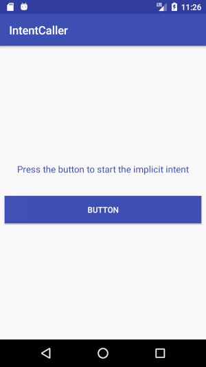

# Implicit intent

Just like we have seen previously, given an application that has two activities, when the app starts, the first activity would be launched by default. By adding a button, we can start the second activity using an explicit intent.


An implicit intent is an intent that can be sent to the operating system. Upon receiving that intent, the OS will search for the corresponding queried Activity and starts it. In case the OS fails to find the queried activity, an error would be thrown.



Here is an example of how we implement this:

First, create an [intent caller application](AppIntentCaller)that has a button to create and start an implicit intent.

```java
package mg.studio.intentcaller;

import android.content.Intent;
import android.support.v7.app.AppCompatActivity;
import android.os.Bundle;
import android.view.View;

public class MainActivity extends AppCompatActivity {

    @Override
    protected void onCreate(Bundle savedInstanceState) {
        super.onCreate(savedInstanceState);
        setContentView(R.layout.activity_main);
        findViewById(R.id.button).setOnClickListener(new View.OnClickListener() {
            @Override
            public void onClick(View view) {
               //Todo: start an activity using an implicit intent
            }
        });

    }
}

```

Next, create a [second application](AppIntentReceiver) with an Activity that has an intent filter with a defined action allowing the launch from our first application. The content of the activity in this second application does not matter much, but the manifest file needs to contain the intent filter with the action that allows triggering the application from another application.

```xml
<?xml version="1.0" encoding="utf-8"?>
<manifest xmlns:android="http://schemas.android.com/apk/res/android"
    package="mg.studio.intentreceiver">

    <application
        android:allowBackup="true"
        android:icon="@mipmap/ic_launcher"
        android:label="@string/app_name"
        android:roundIcon="@mipmap/ic_launcher_round"
        android:supportsRtl="true"
        android:theme="@style/AppTheme">
        <activity android:name=".MainActivity">
            <intent-filter>
                <action android:name="android.intent.action.MAIN" />

                <category android:name="android.intent.category.LAUNCHER" />
            </intent-filter>
        </activity>
        <activity android:name=".SecondActivity"
            android:launchMode="singleInstance">
            <intent-filter>
                <action android:name="mg.studio.intentreceiver.ACTION"/>
                <category android:name="android.intent.category.DEFAULT"/>
            </intent-filter>
        </activity>
    </application>

</manifest>

```
Notice the intent filter for the second activity in this second application.

```xml
            <intent-filter>
                <action android:name="mg.studio.intentreceiver.ACTION"/>
                <category android:name="android.intent.category.DEFAULT"/>
            </intent-filter>
```

You can create and start an intent from our first application to trigger the action specified in this be above intent filter.

Here what we need to add within the onclick listener of our first application.

```java
                /**
                 * If no activity is found by the OS to handle the intent, and exception will araise:
                 * No Activity found to handle Intent { act=mg.studio.intentreceiver.ACTION }
                 */
                Intent mIntent  = new Intent("mg.studio.intentreceiver.ACTION");
                startActivity(mIntent);
```

###Read more about intents:
[Intent filters](https://developer.android.com/guide/components/intents-filters.html)
[Android intent](http://www.vogella.com/tutorials/AndroidIntent/article.html)
