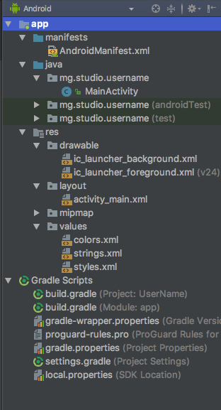
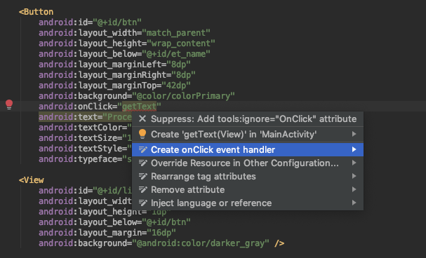
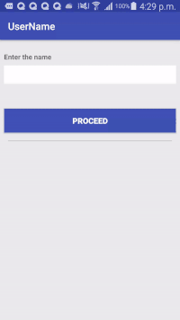
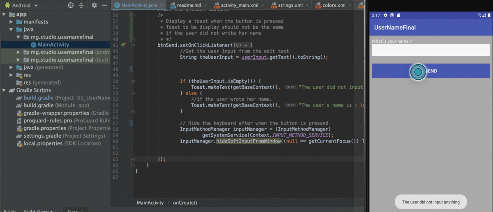

# Getting user input in Android (Java)

This Android application allows users to input text in an EditText. When the EditText has some inputs, and the button "Proceed" is pressed, the app will retrieve the input text and print it in a TextView placed below the button.

## Problem decomposition

### Get to know:
The components of the application: TextView, EditText, Button, and View


### Feature selection
We will complete this application in two versions.

- [ ] Features version 1
  - [ ] the application has a single activity.
  - [ ] the application has a text view that displays "Enter the name"
  - [ ] the application has an editText that will be used to retrieve the user input.
  - [ ] the application has a button named "Proceed". When the button is pressed, the text from the editText is retrieved and displayed in a textview below the button.
  - [ ] the application has a TextView below the button to show the text inserted by the user
  - [ ] a view (line) separates the button and the TextView below it

- [ ] Features version 2
  - [ ] all the features of version 1
  - [ ] validate user input
    - [ ] display an informative toast if a user presses the button Process, but the edit text is still empty.
    - [ ] remove the trailing spaces from the user input
  - [ ] clear the edit text after the user presses the button


### Finished application:


The completed application (Version 2) looks like this:

## Building the application version 1:

Using the android studio, create a new application with one activity.




We will edit the following files:
- manifest.xml,
- MainActivity.java
- activity_main.xml

#### manifest.xml

```xml
<?xml version="1.0" encoding="utf-8"?>
<manifest xmlns:android="http://schemas.android.com/apk/res/android"
    package="mg.x261.username">

    <application
        android:allowBackup="true"
        android:icon="@mipmap/ic_launcher"
        android:label="@string/app_name"
        android:roundIcon="@mipmap/ic_launcher_round"
        android:supportsRtl="true"
        android:theme="@style/AppTheme">
        <activity android:name=".MainActivity">
            <intent-filter>
                <action android:name="android.intent.action.MAIN" />

                <category android:name="android.intent.category.LAUNCHER" />
            </intent-filter>
        </activity>
    </application>

</manifest>
```

#### MainActivity.java

```Java
package mg.x261.username;

import android.os.Bundle;

import androidx.appcompat.app.AppCompatActivity;

public class MainActivity extends AppCompatActivity {

    @Override
    protected void onCreate(Bundle savedInstanceState) {
        super.onCreate(savedInstanceState);
        setContentView(R.layout.activity_main);
    }


}
```

#### activity_main.xml


```xml
<?xml version="1.0" encoding="utf-8"?>
<android.support.constraint.ConstraintLayout xmlns:android="http://schemas.android.com/apk/res/android"
    xmlns:app="http://schemas.android.com/apk/res-auto"
    xmlns:tools="http://schemas.android.com/tools"
    android:layout_width="match_parent"
    android:layout_height="match_parent"
    tools:context="mg.x261.username.MainActivity">

    <TextView
        android:layout_width="wrap_content"
        android:layout_height="wrap_content"
        android:text="Hello World!"
        app:layout_constraintBottom_toBottomOf="parent"
        app:layout_constraintLeft_toLeftOf="parent"
        app:layout_constraintRight_toRightOf="parent"
        app:layout_constraintTop_toTopOf="parent" />

</android.support.constraint.ConstraintLayout>

```

Notice the main layout of our activity_main.xml is a

```
android.support.constraint.ConstraintLayout
```

We just completed the project creation, which has a single activity.

- [ ] Features version 1
  - [x] the application has a single activity.
  - [ ] the application has a text view that displays "Enter the name"
  - [ ] the application has an editText that will be used to retrieve the user input.
  - [ ] the application has a button named "Proceed". When this button is pressed, the text from the editText is retrieved and displayed in a textview below the button
  - [ ] the application has a textview below the button to show the text inserted by the user
  - [ ] a view (in our case here, it is line) separates the button and the textview below it.


I prefer using a RelativeLayout, that said I will change the above accordingly.

To add a textview to the application, let's open the ```activity_main.xml``` file and add the following:
Remove the ```android.support.constraint.ConstraintLayout```from the top and bottom line and replace them with ```RelativeLayout```


```xml

<?xml version="1.0" encoding="utf-8"?>
<RelativeLayout xmlns:android="http://schemas.android.com/apk/res/android"
    xmlns:tools="http://schemas.android.com/tools"
    android:layout_width="match_parent"
    android:layout_height="match_parent"
    android:background="#ebeaeb"
    tools:context="mg.x261.username.MainActivity">


</RelativeLayout>

```

now, to add the ```textView```, add the following inside your ```RelativeLayout```

```xml
    <TextView
        android:id="@+id/tv_title"
        android:layout_width="match_parent"
        android:layout_height="wrap_content"
        android:layout_alignParentTop="true"
        android:layout_marginLeft="8dp"
        android:layout_marginTop="24dp"
        android:text="Enter the name"
        android:textStyle="bold" />
```


So far, your ```activity_main.xml``` should be similar to this:

```xml
<?xml version="1.0" encoding="utf-8"?>
<RelativeLayout xmlns:android="http://schemas.android.com/apk/res/android"
    xmlns:tools="http://schemas.android.com/tools"
    android:layout_width="match_parent"
    android:layout_height="match_parent"
    android:background="#ebeaeb"
    tools:context="mg.x261.username.MainActivity">
    <TextView
        android:id="@+id/tv_title"
        android:layout_width="match_parent"
        android:layout_height="wrap_content"
        android:layout_alignParentTop="true"
        android:layout_marginLeft="8dp"
        android:layout_marginTop="24dp"
        android:text="Enter the name"
        android:textStyle="bold" />
</RelativeLayout>

```

Except this ```tools:context="mg.x261.username.MainActivity"```, where you should have the inverse domain name you used when creating the project.

Test your application; you should have something that looks like this

We just finished adding the textview, it is now time to add the edittext, a button, a view (line), and the second textview for getting the user input.

- [ ] Features version 1
  - [x] the application has a single activity.
  - [x] the application has a text view that displays "Enter the name"
  - [ ] the application has an editText that will be used to retrieve the user input.
  - [ ] the application has a button named "Proceed". When this button is pressed, the text from the editText is retrieved and displayed in a textview below the button
  - [ ] the application has a textview below the button to show the text inserted by the user
  - [ ] a view (line) separates the button and the textview below it


```xml
<?xml version="1.0" encoding="utf-8"?>
<RelativeLayout xmlns:android="http://schemas.android.com/apk/res/android"
    xmlns:tools="http://schemas.android.com/tools"
    android:layout_width="match_parent"
    android:layout_height="match_parent"
    android:background="#ebeaeb"
    tools:context="mg.x261.username.MainActivity">

    <TextView
        android:id="@+id/tv_title"
        android:layout_width="match_parent"
        android:layout_height="wrap_content"
        android:layout_alignParentTop="true"
        android:layout_marginLeft="8dp"
        android:layout_marginTop="24dp"
        android:text="Enter the name"
        android:textStyle="bold" />

    <EditText
        android:id="@+id/et_name"
        android:layout_width="match_parent"
        android:layout_height="wrap_content"
        android:layout_below="@+id/tv_title"
        android:layout_margin="8dp"
        android:background="@android:color/white"
        android:inputType="text"
        android:maxLength="50"
        android:padding="8dp"
        android:singleLine="true"
        android:textCursorDrawable="@android:color/darker_gray"
        android:textSize="15sp" />

    <Button
        android:id="@+id/btn"
        android:layout_width="match_parent"
        android:layout_height="wrap_content"
        android:layout_below="@+id/et_name"
        android:layout_marginLeft="8dp"
        android:layout_marginRight="8dp"
        android:layout_marginTop="42dp"
        android:background="@color/colorPrimary"
        android:onClick="getText"
        android:text="Proceed"
        android:textColor="@android:color/white"
        android:textSize="16sp"
        android:textStyle="bold"
        android:typeface="sans" />

    <View
        android:id="@+id/line"
        android:layout_width="match_parent"
        android:layout_height="1dp"
        android:layout_below="@+id/btn"
        android:layout_margin="16dp"
        android:background="@android:color/darker_gray" />

    <TextView
        android:id="@+id/display"
        android:layout_width="match_parent"
        android:layout_height="match_parent"
        android:layout_below="@+id/line"
        android:layout_marginBottom="8dp"
        android:layout_marginLeft="8dp"
        android:layout_marginRight="8dp"
        android:layout_marginTop="54dp"
        android:padding="8dp" />

</RelativeLayout>

```
Now that we have our layout ready, you can run the application and test it. How does it look like?

- [ ] Features version 1
  - [x] the application has a single activity.
  - [x] the application has a text view that displays "Enter the name"
  - [x] the application has an editText that will be used to retrieve the user input.
  - [ ] the application has a button named "Proceed". When this button is pressed, the text from the editText is retrieved and displayed in a textview below the button
  - [x] the application has a text view below the button to show the text inserted by the user
  - [x] a view (line) separates the button and the text view below it


Time to work on our java file. Notice the ids ```display```, ```btn```, and ```et_name``` as we need to use them in the java file to refer to the views.

```Java
package mg.x261.username;

import android.os.Bundle;

import androidx.appcompat.app.AppCompatActivity;

public class MainActivity extends AppCompatActivity {

    @Override
    protected void onCreate(Bundle savedInstanceState) {
        super.onCreate(savedInstanceState);
        setContentView(R.layout.activity_main);
    }


}
```

To connect your button view with your java file, you can go back to your ```activity_main.xml``` and over the ```onClick``` under your button, you should bet something that looks like this



and this will create a method inside your ```MainActivity.java```

```java
    /** your previous code */    
    public void getText(View view) {
    
    }

```

You can write your code logic to be executed inside that getText.

```Java
            TextView mDisplay = findViewById(R.id.display);
            EditText mEditText = findViewById(R.id.et_name);
            mDisplay.setText(mEditText.getText().toString());
```

Now, your complete MainActivity.java file should look like [this](app/src/main/java/mg/studio/username/MainActivity.java)

- [ ] Features version 1
  - [x] the application has a single activity.
  - [x] the application has a text view that displays "Enter the name"
  - [x] the application has an editText that will be used to retrieve the user input.
  - [x] the application has a button named "Proceed". When this button is pressed, the text from the editText is retrieved and displayed in a text view below the button
  - [x] the application has a text view below the button to show the text inserted by the user
  - [x] a view (line) separates the button and the textview below it


We completed version 1



Not, it is up to you to update this application and complete version 2.


- [ ] Features version 2
  - [ ] all the features of version 1
  - [ ] validate the user input
    - [ ] display an informative toast if user presses the button Process but the edit text is empty.
    - [ ] remove the trailing spaces form the user input
  - [ ] clear the edit text after the user presses the button
  - [ ] hide the keyboard when the text is shown on the textview

Feel free to check [this](https://github.com/dragona/android-intro/tree/master/01_UserName_Final)


    
